Это мини end-to-end система для сбора и анализа данных фитнес-трекера. (В теории) она собирает такие данные как: шаги, потраченные каллории и пульс. А также (теоретически) на основании этих данных определяет что делает сейчас человек: отдыхает, ходит или бежит (занимается активной деятельностью).
Потом эти данные отправляются на хранение в БД с одной таблицей, после чего могут быть исследованы с помощью redash. То есть можно построить графики, таблицы и дашборды для наглядного анализа собранной информации.
На практике же происходит случайная генерация этих значений. То есть сначала случайным образом выбирается в каком состоянии сейчас пребывает человек: отдых, ходьба или бег -- а затем, на основании выбранного, уже генерируются значения шагов, пульса и каллорий. И уже эти данные отправляются в базу данных для дальнейшего анализа в redash.
Данная система представляет собой контейнер, работающий на платформе Docker. Поэтому для его работы переходим в директорию системы:
cd fitness-tracker
А затем запускаем его командой:
docker-compose up -d
Затем, поскольку redash нельзя запускать без инициализации БД, то сразу после запуска создаем базу данных для redash:
docker-compose run --rm redash-server create_db
После этого необходимо пересобрать образы, так как python скрипт будет отрабатывать некорректно:
docker-compose up -d --build
Затем переходим на сайт localhost:5000 и видим открывшуюся страницу redash:
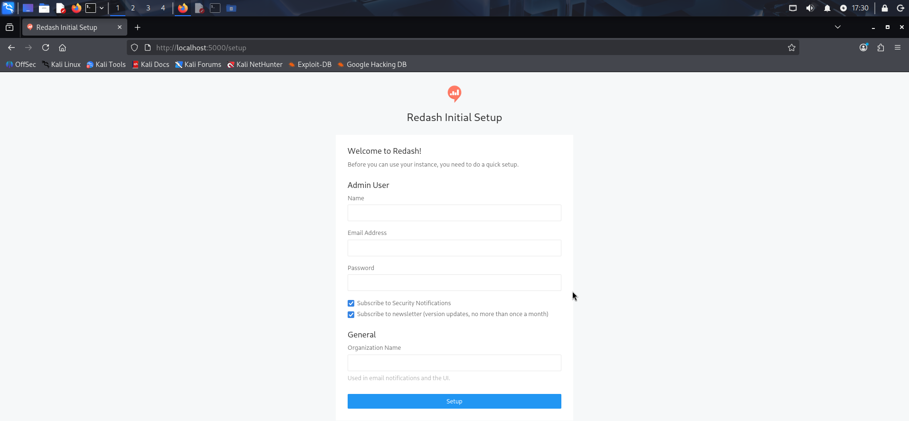
Регистрируемся там и переходим на главную страницу:
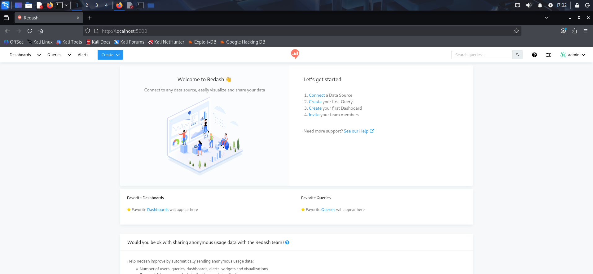
Переходим во вкладку Create => Query. Для начала нас попросят подключить базу данных. В появившемся окне выбираем PostgreSQL и вводим данные для подключения к БД:
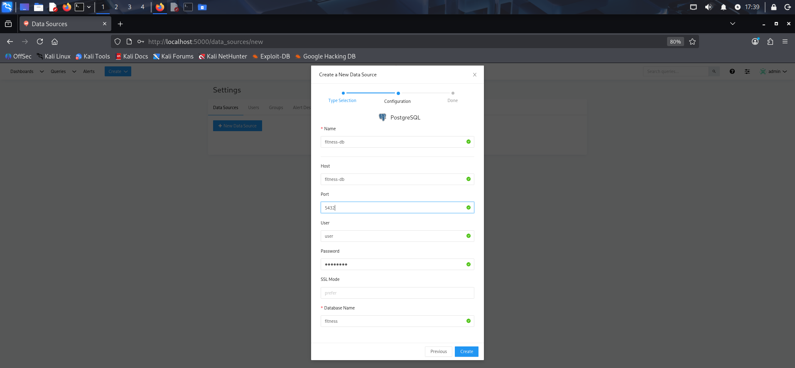
Нажав на Test Connection внизу, можем удостовериться, что все данные были введены правильно
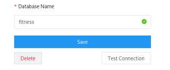
Повторно переходим во вкладку Create => Query.Здесь мы можем собрать выборку по данным и уже с ней работать. Например, нам нужно сделать график пульса по времени. Для этого вводим соответствующий sql-запрос, нажимаем execute и видим внизу табличку с данными:
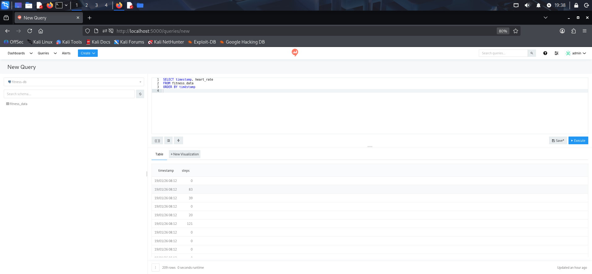
Затем, нажимаем на New Vizualization, в Chart Type выбираем line и выбираем, что по X у нас будет timestamp, то есть время, и по Y будет heart_rate, то есть пульс. И в итоге видим красивый график:
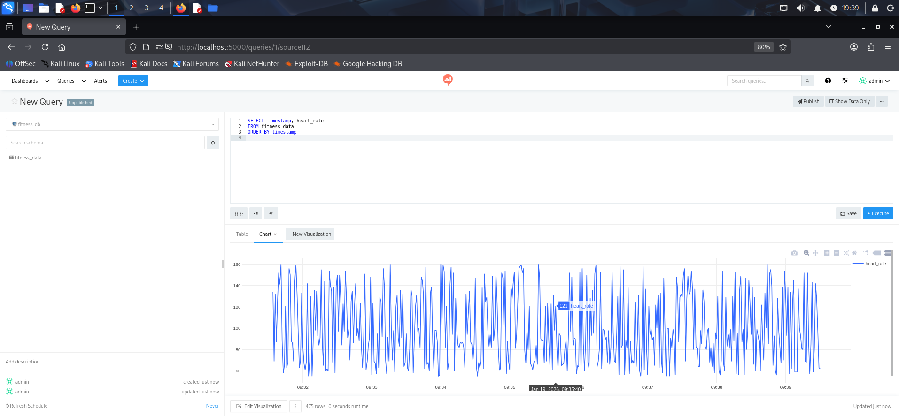
Теперь нужно сделать еще 2 визуализации. В первой будет зависимость количества шагов от времени:

А во второй будет подсчет общего количества состояний: отдыха, ходьбы и бега:
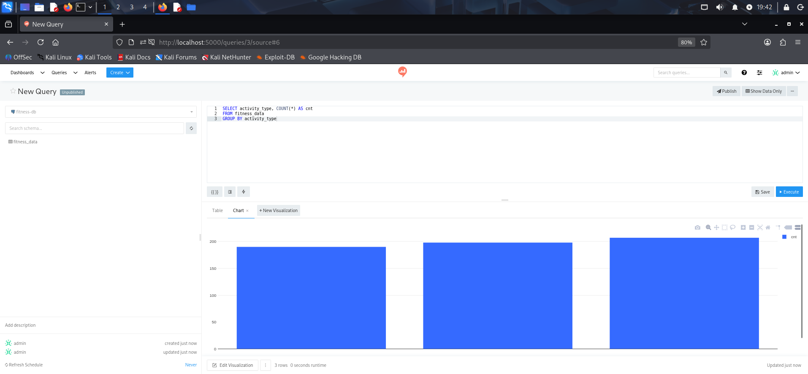
Перед тем как создать дашборд, переходим в Queries, выбираем поочередно каждую визуализацию и нажимаем Publish:
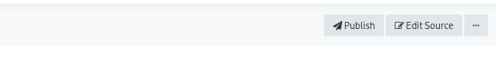
Затем переходим в Dashboards, создаем новый дашборд, который мы называем fitness analytics. Внизу видим Add Widget:
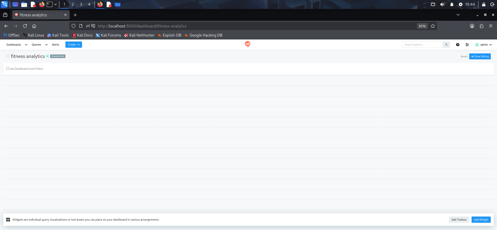
Нажимаем туда и поочередно добавляем все созданные ранее визуализации:
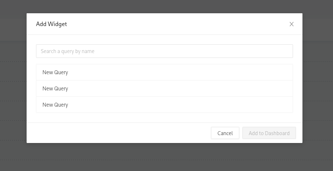
Также нужно выбрать не table, а chart:
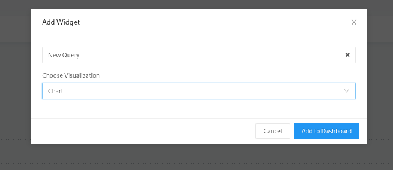
Конечный результат:
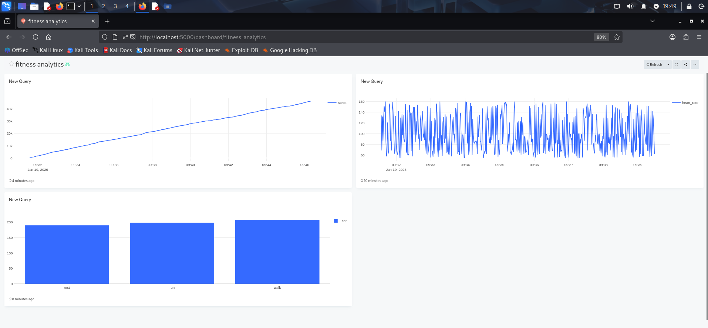
